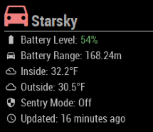

# MMM-TeslaStatus
A [MagicMirror](https://github.com/MichMich/MagicMirror)'s Module to show my Tesla status using [Firebase Realtime Database](https://firebase.google.com/docs/database)

The project consumes data posted by [https://github.com/aduyng/tesla-client](https://github.com/aduyng/tesla-client) which pushes tesla status to a firebase.

[](https://circleci.com/gh/aduyng/MMM-TeslaStatus/tree/master)

## Screenshots


## Installation
### 1. Setup the MagicMirror module
```bash
cd ~/MagicMirror/modules
git clone https://github.com/aduyng/MMM-TeslaStatus.git
cd MMM-TeslaStatus
npm install --production
```
### 2. Setup Firebase Realtime Database
You will need a realtime database for Smartthings to push the device status to. Follow this tutorial, https://firebase.google.com/docs/web/setup, to setup a Firebase project and a realtime database.

Take note of the project configuration especially the realtime database URL.

## Configuration
```javascript
  {
			module: "MMM-TeslaStatus",
			position: "top_right",
			config: {
				firebaseDatabaseRootRef: '/vehicles/<vehicleId>', // the path of the realtime database to listen to
				firebaseConfig : {
					apiKey: "<the api key>",
					databaseURL: "<the realtime database URL>",
					projectId: "<the project id>",
					appId: "<the appId - optional>"
				}
			}
  }
```
